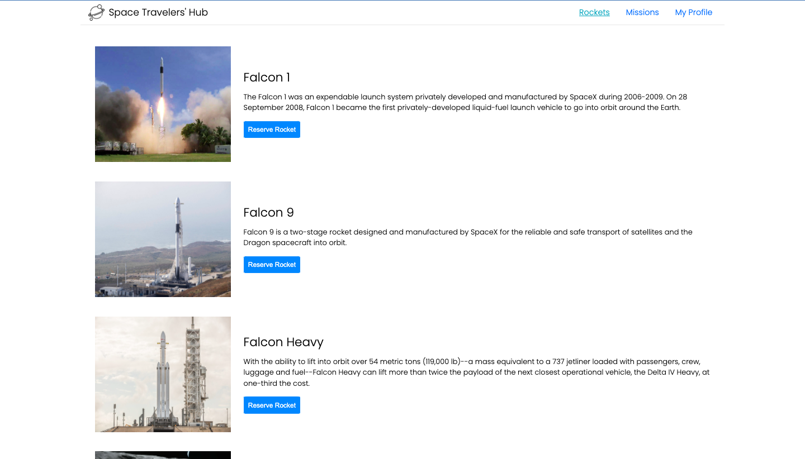
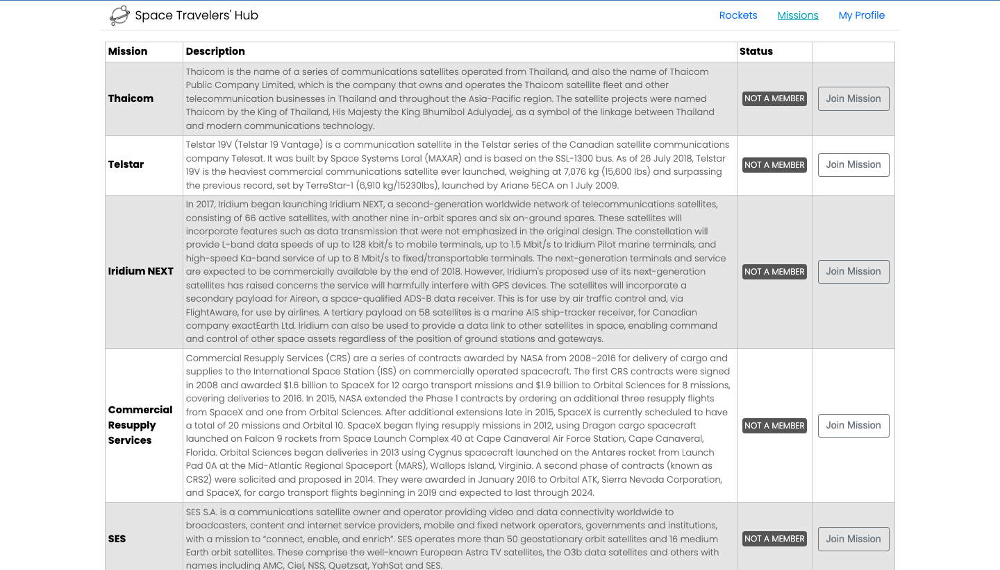
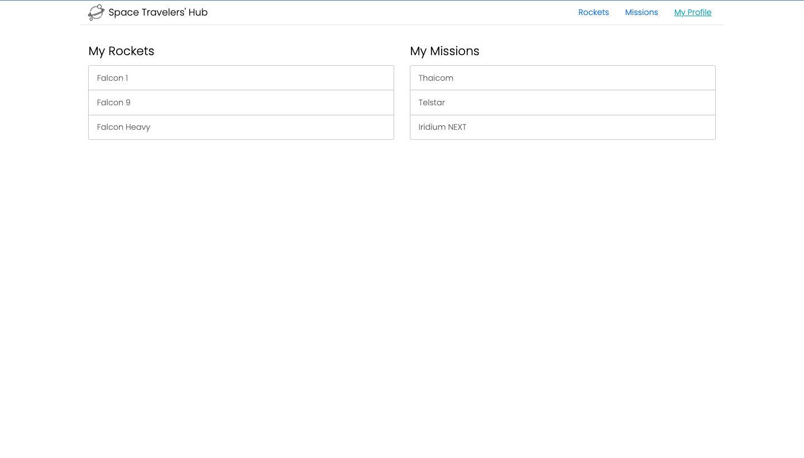

`React` `Redux` `ES6` `NPM` `LINTERS` `GITFLOW`  

# Space Travelers Hub

This web application provides commercial and scientific space travel services. The application allows users to book rockets and join selected space missions.

## Screenshot 

## Built With

- React
- Redux
- ES Modules
- Linters

## See Project

[Space Travelers Hub](https://resilient-eclair-b07bd1.netlify.app/)

## Getting Started

Clone the repo into your local machine.
`https://github.com/Fadahunsiseyi/spaceHub.git`

To get a local copy up and running follow these simple example steps.

### Prerequisites

`NPM` should be installed.

### Install

run `npm install` to install dependencies

### Usage
run npm start.

## Authors(3)

👤 **Fadahunsi seyi**

- GitHub: [Fadahunsiseyi](https://github.com/Fadahunsiseyi)
- Twitter: [Fadahunsiseyi_](https://twitter.com/@Fadahunsiseyi_)
- LinkedIn: [fadahunsi-seyi-samuel](https://www.linkedin.com/in/fadahunsi-seyi-samuel-49191a209/)

👤 **Idriss Omar**

- GitHub: [@omarbabou](https://github.com/omarbabou)
- Twitter: [@BabouOmar3](https://twitter.com/BabouOmar3)
- Linkedin: [Idrissa Omar Makoba](https://www.linkedin.com/in/idrissa-makoba-omar/)

👤 **ADEBOWALE ADEGBOYE**

- GitHub: [ademibowale](https://github.com/ademibowale)
- Twitter: [Ademibowale1](https://twitter.com/Ademibowale1)
- LinkedIn: [adebowale-adegboye](https://www.linkedin.com/in/adebowale-adegboye-143568221/)

## Contribute

Contributions, issues, and feature requests are welcome!

Feel free to check the [issues page](https://github.com/Fadahunsiseyi/spaceHub/issues)

## Acknowledgements

The authors highly appreciate the help in the project from all the participants of this week's program for the timely response to all questions from our team.

## 📝 License

This project is [MIT](./MIT.md) licensed.
